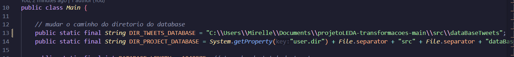

# Projeto LEDA - Algoritmos de ordenação (Tweets Dataset) 

A primeira etapa do projeto da disciplina de Laboratório de Estrutura de Dados tem como objetivo a transformação das datas do arquivo "tweets.csv", gerando um novo CSV nomeado como "tweets_formated_data.csv".

A partir das transformação da data, cria duas novas colunas contendo novas informações e dados sobre elas, armazenado em um novo CSV chamado “tweets_mentioned_persons.csv”.

Para a segunda etapa do projeto, foi feita uma comparação com algoritmos de ordenação estudados na disciplina utilizando uma grande massa de testes. No final, houve a elaboração do relatório com os resultados obtidos.


## Como rodar o código

1. Clone o repositório:
  - No terminal, execute:
     ```bash
     git clone https://github.com/ellerimx/projetoLEDA-transformacoes.git
     ```

   - Depois de dar o git clone, entre na página do projeto:
       ```cmd
       cd projetoLEDA-transformacoes
       ```

2. Baixe o arquivo que contém a dataBase no link: [Download do dataBase](https://drive.google.com/drive/u/1/folders/1x3Zxj89-YURgY7_dVkE1ONW_qqfSDNyb) 

3. Coloque o arquivo na pasta correta.
   - Após o download no passo 2, mova o arquivo ``` tweets.csv ``` para a pasta ```dataBaseTweets```, que está no repositório clonado. Copie o caminho do diretório e cole no local: 
      exemplo: ```public static final String DIR_TWEETS_DATABASE = "COPIAR CAMINHO DO DIRETÓRIO AQUI";```

   

   obs: Garanta que para o Windows esteja com duas barras (como mostrado no print acima)
   Para sistemas de Linux e macOS: o caminho do diretório utiliza barras simples "/".

4. Verifique que o arquivo e as alterações necessárias estejam corretas.

5. Execute o projeto na sua IDE java.

__________

Link com commits da primeira entrega: [print](https://drive.google.com/file/d/1hPedfjo_sTyTc6mWou9IbI_eFsN4ClZ7/view?usp=drive_link)

Link do relatório: [Relatório LEDA - algoritmos de ordenação](https://drive.google.com/file/d/1FxMFbImFFEYHl5DOJU00audjLnL00plE/view?usp=sharing)

Link para os arquivos CSV gerados ao executar o projeto: [Arquivos CSV e gráficos de comparação](https://drive.google.com/drive/u/1/folders/1idAhQp4O9yCKKSVamBAke2r9I88DlpBY)

